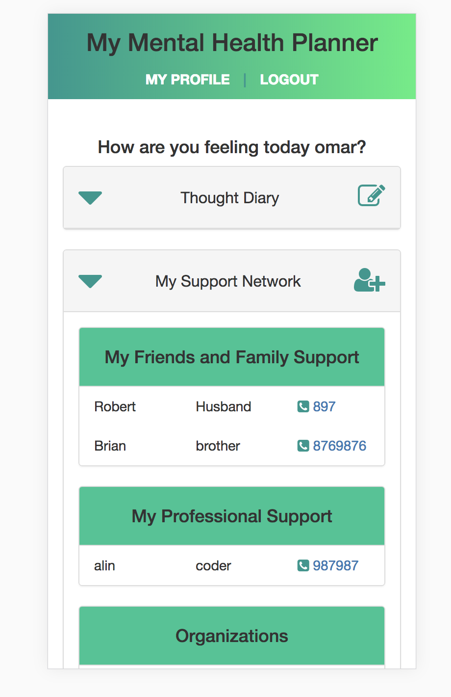
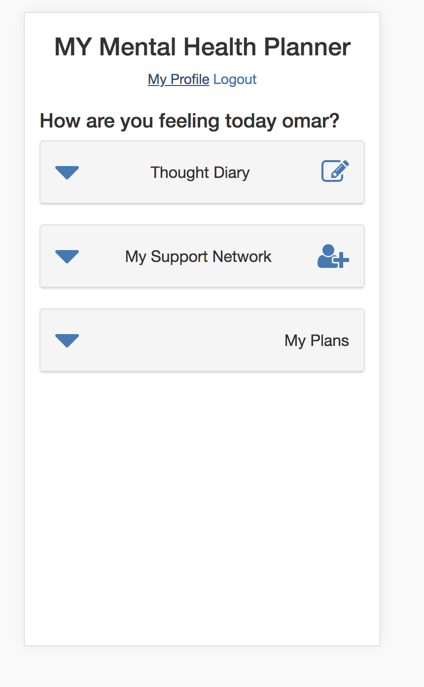
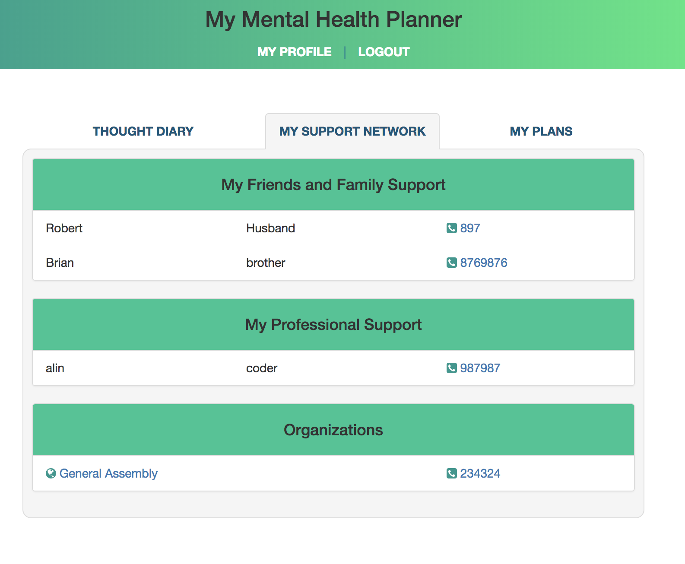

## Mental Health Planner

<figure>
  
  <figcaption>This was the 4th and last project for the Web Development immersive.  Completed in one week after 11 weeks of course work.  I merged my experience as a social worker and web developer. It is a web application for mental health service users to use as a tool to manage their crisis plan.
  </figcaption>
</figure>

### Project Brief

Your app must:

* **Use Mongo, Express and Node** to build an API and a **React front-end app** that consumes it
* **Create an API using at least 2 related models**, one of which should be a user
* Include **all major CRUD functions** in a **RESTful API** for at least one of those model
* **API must include tests for the authentication and restful routes
* **Consume your own API** by making your front-end app with **React** using some 3rd party dependencies such as **ui.router** and **ng-resource**
* **Add authentication to your API** to restrict access to appropriate users
* **Craft thoughtful user stories together**, as a team
* Layout and style your front-end with **clean & well-formatted CSS**
* **Deploy your application online** so it's publically accessible
* A **link to your hosted working app** in the URL section of your Github repo
* **A ``readme.md`` file**

### Installation and setup

#### Run Locally
- Download or clone the [Github repo](https://github.com/omrprt/wdi-fourth-project)

#### View Online
- [View on Heroku](https://mhplanner.herokuapp.com/)
- [View on Github](https://github.com/omrprt/wdi-fourth-project)

### Approach Taken

1. Reviewed the project brief
2. Worked on the user story.
3. Worked on the wireframe.
4. Worked on the file structure.
5. Worked on the RESTful routes.
6. Worked on the API
7. Added styling using scss
8. Had UX feedback.
9. looped again and again.

<figure>
  
  <figcaption>Wireframe using Balsamiq</figcaption>
</figure>

### Technologies Used

### Dependencies
- axios
- bcrypt
- bluebird
- body-parser
- bootstrap-css-only
- express
- express-flash
- express-session
- font-awesome
- jsonwebtoken
- mongoose
- morgan
- react
- react-bootstrap
- react-dom
- react-router-dom

### Others

- HTML5
- SCSS
- bulma
- Javascript (ECMAScript 6)
- jQuery
- Git
- Github
- Heroku
- Atom
- GIMP
- GULP
- https://balsamiq.com/
- https://trello.com/
- https://fonts.google.com/
- https://uigradients.com/
- https://coolors.co/
- http://fontawesome.io/

### Challenges Faced

- Drying up the code
- Coding for both mobile and large screen
- Making the models reference the user models

<figure>
  
  <figcaption>Getting Errors in the Code</figcaption>
</figure>

### Where next?

How can the app be extended and improved:

- making some of the schema's editable:
 * currently can't update profile information
 * currenlty can't delete or edit diary or plan entries.
 * currently can't delete or edit support network entries.

- add modals:
 * looking to add more plans, for example a recovery plan.

- Improving the code:
  * I am certain that there are areas of my code to be more efficient and dryer.
  * the code could be refactored further.

- Improve user experience:
  * Futher improve how information is presented in order to have a better user experience.
  * ha a share option with other users.

- Utilize more APIs:
  * have a goole map with markers of where your support networks live.

## Acknowledgments
* Would like to thank my instructors at GA, and classmates.
* Thanks to Robert, Brian, Josh and social worker colleagues for their ux feedback.
* Thanks to our partners for their ongoing support.
* Thanks to our friends that continue to encourage and support us.

<figure>
  
  <figcaption>A view on large screens</figcaption>
</figure>
